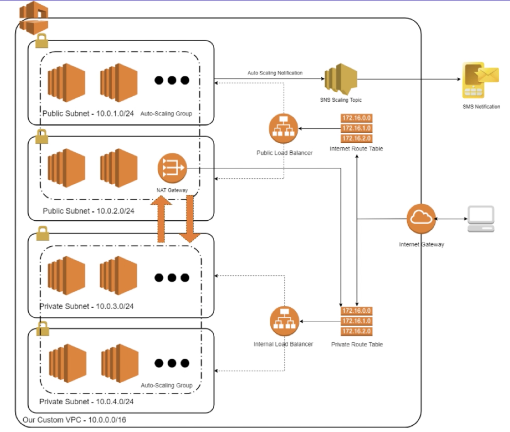

# terraform_project
VPC solution with EC2 for production AWS with terraform

## High Level Architecture


## Getting started
- cd `../infrastructure` dir
- Initialise backend config
```terraform init backend-config="infrastructure-prod.config"```. 
In the case of the config not being picked up, run `terraform init` and manually provide the config values.
- Run `terraform plan -var-file="production.tfvars" ` to see
any changes that are required for your infrastructure.
- Apply the infrastructure changes `terraform apply -var-file="production.tfvars"`

*Follow same instructions for the `intances` dir:
- cd `../instances` dir
- Initialise backend config
```terraform init backend-config="backend-prod.config"```
- Run `terraform plan -var-file="production.tfvars" ` to see
any changes that are required for your infrastructure.
- Apply the infrastructure changes `terraform apply -var-file="production.tfvars"`


## Destroy infrastructure
- cd `../infrastructure` dir
- Infrastructure managed by Terraform will be destroyed when you run `terraform destroy -var-file="production.tfvars" `

## Prerequisites
These steps should be familiar if you're familiar with AWS & terraform.

- Create an AWS account
- Setup IAM user
- Create keypair
- Setup S3 bucket (This code used `terraform-remote-state-2019-07-30`) for the TF scripts

- Install aws-cli
- Install terraform 

## Prerequisites
Once IAM user created, take note of the Access key ID & Secret key. We'll use this to configure aws and login using the cli. Edit and run [aws-cli-login](./aws-cli-login.sh). 
Alternatively, set your env vars by running this in your terminal:

```export AWS_ACCESS_KEY_ID="YOUR_ACCESS_KEY"```

```export AWS_SECRET_ACCESS_KEY="YOUR_SECRET_KEY"```

List S3 buckets to help test access: 
```aws s3 ls```

## Debug / tracing
 In case of any issues, you get a detailed trace by setting an env var.

`export TF_LOG=TRACE`

## Source
[VPC-with-EC2](https://www.udemy.com/vpc-solutions-with-ec2-for-production-aws-with-terraform/)

[aws-architecture](https://github.com/neocorp/aws_vpc_ec2)
